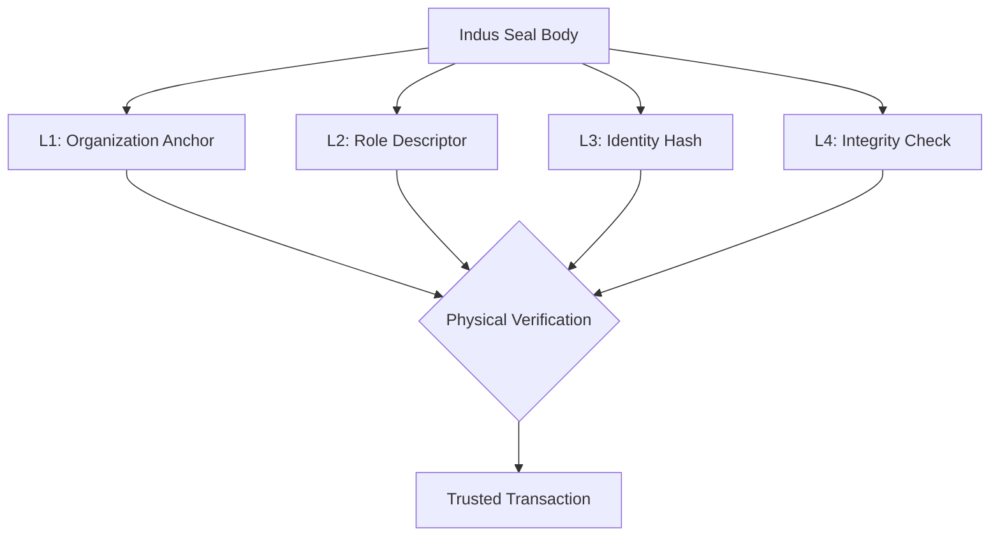

# [IIP] Indus-Identity-Protocol v1.0

## 🏛️ Project Concept
未解読の「インダス文字」を言語学ではなく、古代の物流・権限管理システム（IDシステム）としてリバースエンジニアリングした論理モデルの定義。

## ⚙️ Architecture: Logical Defense Anchor
LDG V2 (Logical Defense Grid) の思想に基づき、印章のデータ構造を以下の検証鎖として定義する。

